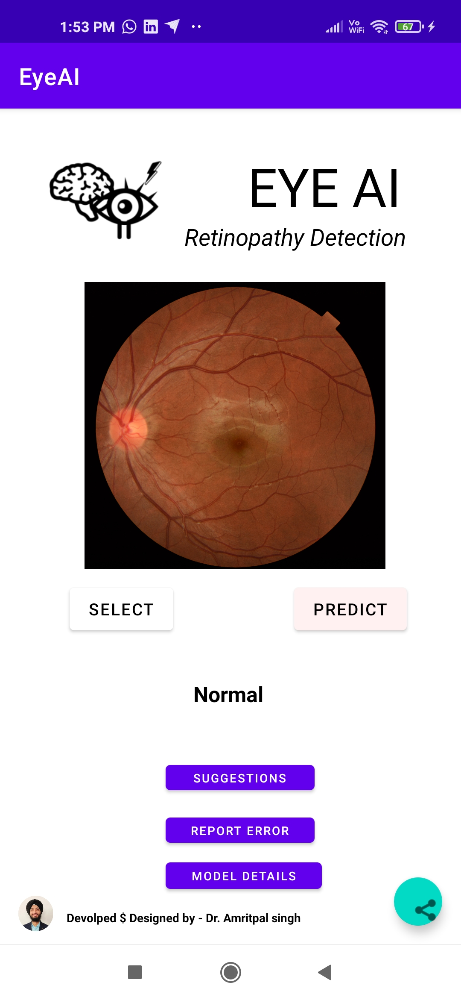
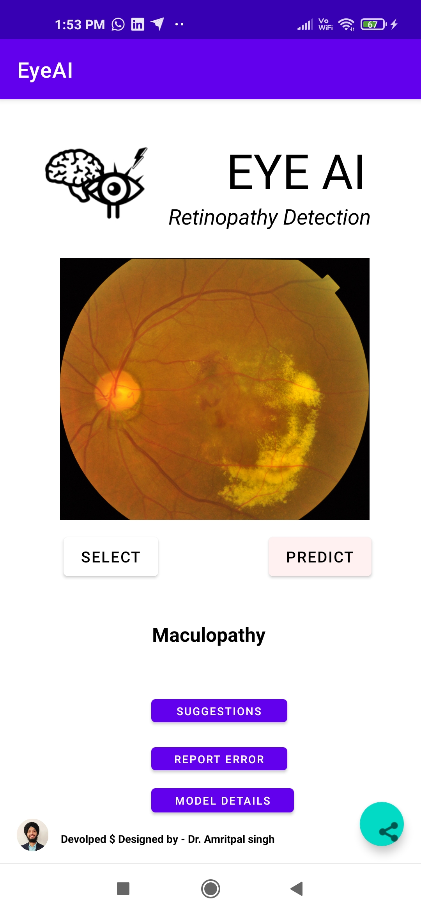
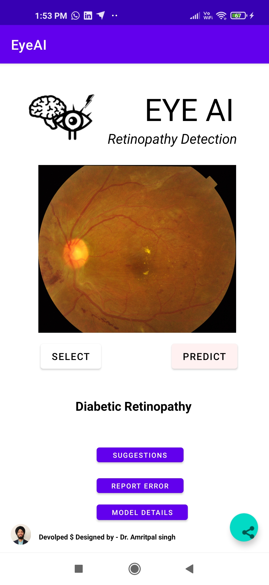
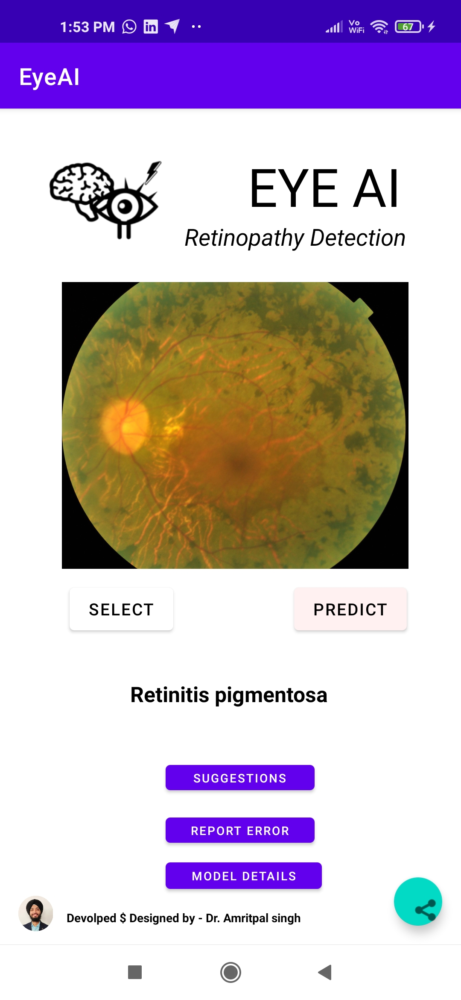
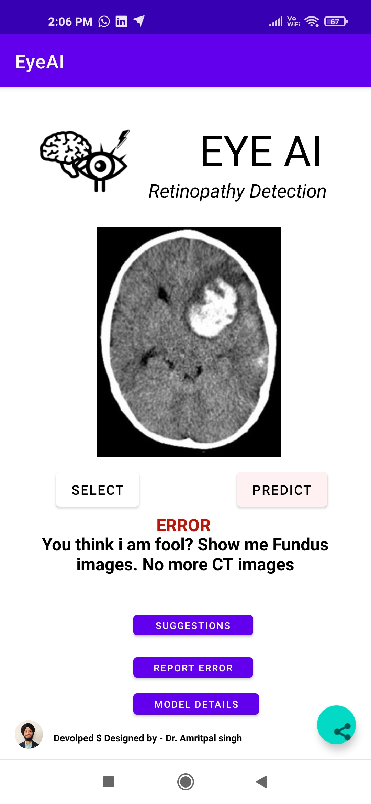
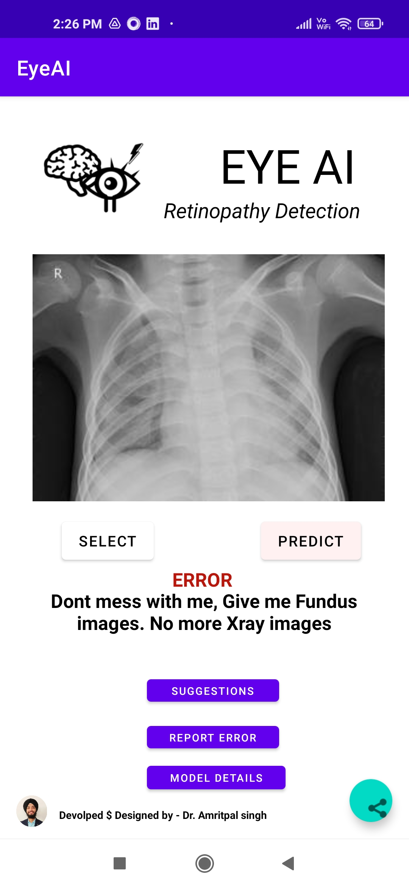
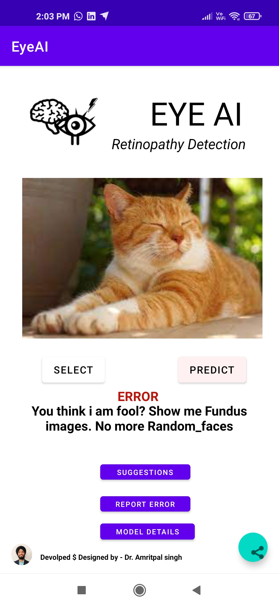
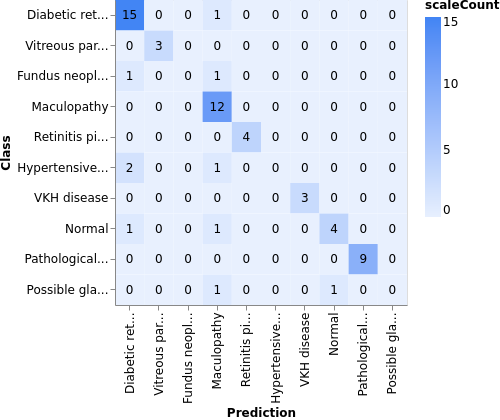

# EyeAI   

## Image source

## Other information

- [Resize image in the wiki of github using markdown](http://stackoverflow.com/questions/24383700/resize-image-in-the-wiki-of-github-using-markdown)
- [how to change image size markdown](http://stackoverflow.com/questions/14675913/how-to-change-image-size-markdown)

## Retniopathy detection 

AIM - Deploying deep learning models for opthalmology diagnosis

## Goals - 
- [x] Train models
- [x] Test models
- [x] Android app framework to deploy model
- [x] On device model prediction
- [x] Capture image / Upload image from device
- [x] Image testing before prediction(Is it a Retina image or not?)
- [x] Report False predictions by model
- [ ] Add "Share AI's Report" button
    - [x] Without images 
    - [ ] With images 
- [x] Suggestions to improve app button 
- [ ] Prediction probabilities
- [ ] Choosing model function - Multiple models for different diseases
- [ ] Annonymization of files before sending to model
- [ ] Image augmentation before making prediction

Frameworks used - 
- Model training - Tensorflow lite
- Android deployment - Kotlin and Android Studio

App size - 20 mb 
Coverage of Android devices - more than 98% 

## Screenshots
| Normal                  |  Diabetic retinopathy | Maculopathy | Retinitis pigmentosa |
| :---:                     |     :---:      |          :---: |          :---: |
|  |    |     |     |

## False image type prediction
| CT scans                   |  Xrays | Random faces | Screenshots |
| :---:                     |     :---:      |          :---: |          :---: |
|  |    |     |     |

## Model training results
|            Confusion matrix | 
|                      :---:      |
|     |

| Class                    | Data size | Accuracy |
| :---                     | :---:   | ---: |
| Normal                   |   a     |   1  |
| Diabetic retinopathy     |   a     |   1  |
| Maculopathy              |   a     |   1  |
| Retinitis pigmentosa     |   a     |   1  |

### Maybe sometime in future
- [ ] Uploading folder of images at once
- [ ] Cloud based interpretation on bigger/better models
- [ ] Links to model training process and accuracy statistics
- [ ] GradCam/Explainable AI components

